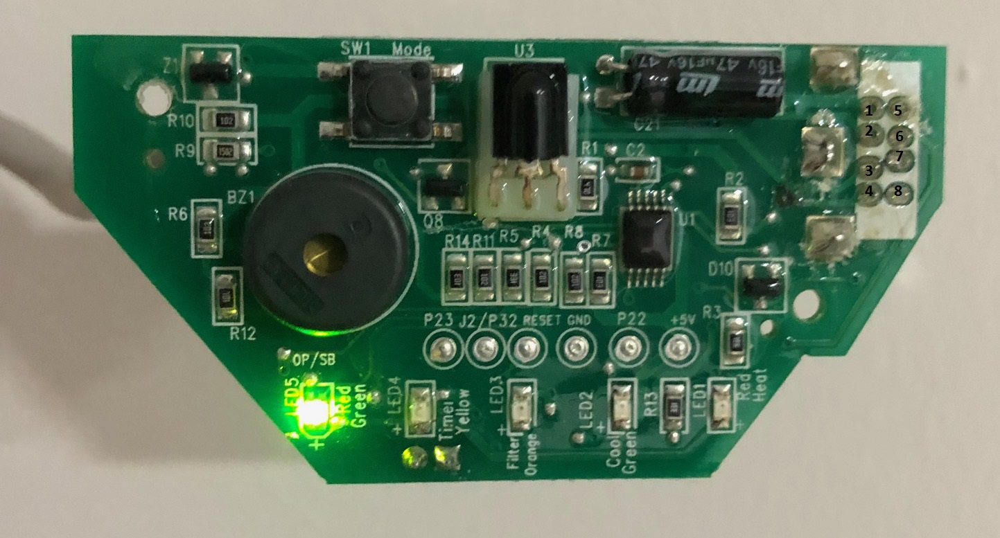
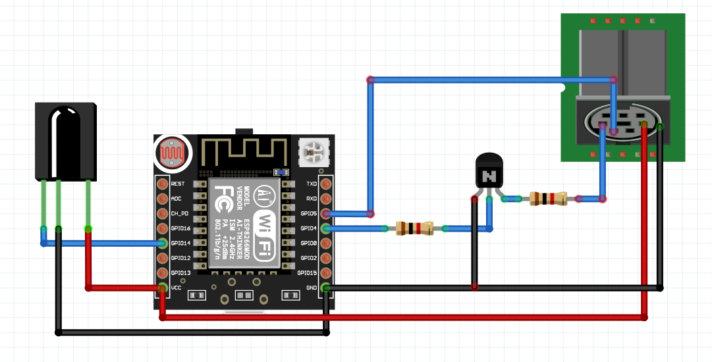

# ElectraWifi
This project intends to replace a plain Electra AC IR receiver with an ESP8266 to give it wifi capabilities and control it over MQTT.

## Description

The original receiver itself is "dumb" and doesn't hold any state and all the interaction is handled by the main unit, this makes it expandable so it can easily be replaced by an ESP8266.

The receiver is connected to the main unit with an 8-pin mini din connector, with the following pins:

1. 5V
3. IR signal
4. Green power led (LOW for on)
6. Beep

So now all we need to do is throw out the old receiver and hook up an ESP8266 to the pins 1, 3, 4.

## Prerequisites
### Hardware
First you would need:
- ESP8266 (ESP32 would also work)
- 1 NPN transistor
- 2 1kΩ resistors
- A breadboard/PCB
- IR receiver (optional)

Hook everything up according to the following schematic:

To use the code as-is, use GPIO4 for IR send, GPIO5 for power state input and GPIO14 for IR recv (optional).

### Software
The code in this repo is based on [Homie](https://github.com/homieiot/homie-esp8266) for MQTT handling and for OTA.
Please follow the instructions there to install all the dependencies.

Once the code is installed on the esp, it will boot in configuration mode. Follow the instructions [here](https://homieiot.github.io/homie-esp8266/docs/2.0.0/configuration/json-configuration-file/) to upload a JSON configuration file.

## Usage
After the esp is configured, it will subscribe to the following MQTT topics:
- .../settings/json/set 
  - This topic accepts a json in the following format (all fields are mandatory), updates the state and send it to the AC unit:   
  `{"power": "on|off", "mode": "cool|heat|fan|dry|auto", "fan": "low|med|high|auto", "temperature": 15..30, "ifeel": "on|off"}`
- .../ifeel_temperature/state/set
  - This topic accepts a number between 5 and 36 and sends it to the main unit as a temperature received by the "i feel" function of the remote.
  
Monitoring and getting the real state of the AC is also possible by subscribing to the following topics:
- .../power/state
- .../mode/state
- .../fan/state
- .../temperature/state
- .../ifeel/state

### Credits
Many thanks to @barakwei and [IRelectra](https://github.com/barakwei/IRelectra) for analyzing the IR protocol.
